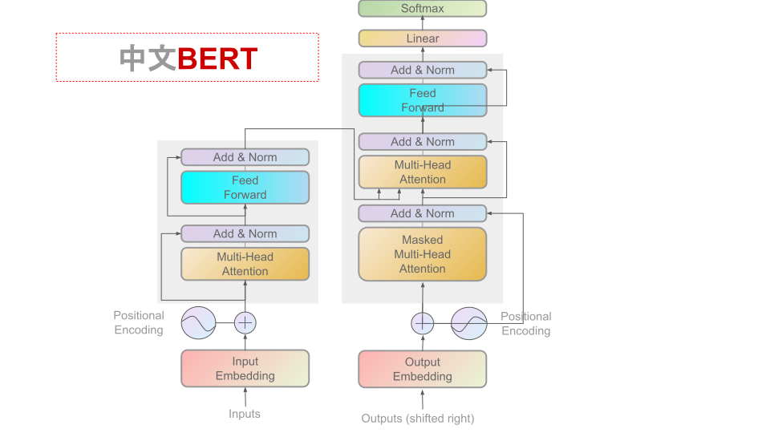

[**中文说明**](./README.md) | [**English**](./readme_en.md)

<p align="center">
    
</p>

本项目提供了面向中文的BERT预训练模型，旨在丰富中文自然语言处理资源，提供多元化的中文预训练模型选择。
欢迎各位专家学者下载使用，并共同促进和发展中文资源建设。

本项目基于谷歌官方BERT：https://github.com/google-research/bert

其他相关资源：
- 中文BERT预训练模型：https://github.com/ymcui/Chinese-BERT-wwm


## 新闻
**2023/5/27 发布Sentence-BERT:Drogo, Base, Large, Multi-Lingual-Base**
Sentence-Bert仅用于文本向量化表示时效果较好，参考sentence_transformers项目。


<details>
<summary>历史新闻</summary>

2023/5/23 发布Stark-BERT: Eddard, Lyarra, Rickard, Lyanna,包括tf、pytorch模型。
12-layer, 768-hidden, 12-heads, 102.3M/105.1M parameters 
训练20万步。
2023/5/22 发布夜王BERT: bert_night-king_36L_cn,包括tf、pytorch模型。中文模型bert_night-king：其详细参数为36-layer, 1024-hidden, 16-heads, 476.7M parameters  
2023/5/16 发布中文预训练模型BERT-Tiny-CN，BERT-Mini-CN。  
由新闻语料训练100k步。超参数与谷歌BERT基本一致。  
BERT-Tiny: masked_lm_accuracy=22.74%，NSP_accuracy=100%。  
BERT-Mini: masked_lm_accuracy=33.54%，NSP_accuracy=100%。  
上述分词MASK方法使用谷歌默认方法：区分大小写，按中文字分词。
词表采用谷歌中文默认的21128个词的词表。  

2023/5/9 修复下载链接
2021/2/6 所有模型已支持Pytorch和Tensorflow1以及Tensorflow2，请通过transformers库进行调用或下载。https://huggingface.co/
2021/2/6 本目录发布的模型未来可接入[Huggingface-Transformers](https://github.com/huggingface/transformers)，查看[快速加载](#快速加载)
2021/2/6 `bert_12L_cn`已可下载，查看[模型下载](#模型下载)
2021/2/6 提供了在小规模通用语料（12.5MB）上训练的中文`bert_12L_cn`模型，查看[模型下载](#模型下载)
</details>

## 内容导引

| 章节 | 描述 |
|-|-|
| [简介](#简介) | 介绍BERT-wwm基本原理 |
| [模型下载](#模型下载) | 提供了中文预训练BERT下载地址 |
| [基线系统效果](#基线系统效果) | 列举了部分基线系统效果 |
| [预训练细节](#预训练细节) | 预训练细节的相关描述 |
| [下游任务微调细节](#下游任务微调细节) | 下游任务微调细节的相关描述 |
| [FAQ](#faq) | 常见问题答疑 |
| [引用](#引用) | 本目录的技术报告 |

## 简介

**Whole Word Masking (wwm)**，暂翻译为`全词Mask`或`整词Mask`，是谷歌在2019年5月31日发布的一项BERT的升级版本，主要更改了原预训练阶段的训练样本生成策略。
简单来说，原有基于WordPiece的分词方式会把一个完整的词切分成若干个子词，在生成训练样本时，这些被分开的子词会随机被mask。
在`全词Mask`中，如果一个完整的词的部分WordPiece子词被mask，则同属该词的其他部分也会被mask，即`全词Mask`。

**需要注意的是，这里的mask指的是广义的mask（替换成[MASK]；保持原词汇；随机替换成另外一个词），并非只局限于单词替换成`[MASK]`标签的情况。
更详细的说明及样例请参考：[#4](https://github.com/ymcui/Chinese-BERT-wwm/issues/4)**

同理，由于谷歌官方发布的`BERT-base, Chinese`中，中文是以**字**为粒度进行切分，没有考虑到传统NLP中的中文分词（CWS）。
我们将全词Mask的方法应用在了中文中，使用了中文维基百科（包括简体和繁体）进行训练，并且使用了分词工具，即对组成同一个**词**的汉字全部进行Mask。

下述文本展示了`全词Mask`的生成样例。
**注意：为了方便理解，下述例子中只考虑替换成[MASK]标签的情况。**

| 说明       | 样例 |
|:---------| :--------- |
| 原始文本     | 使用语言模型来预测下一个词的probability。 |
| 分词文本     | 使用 语言 模型 来 预测 下 一个 词 的 probability 。 |
| 原始Mask输入 | 使 用 语 言 [MASK] 型 来 [MASK] 测 下 一 个 词 的 pro [MASK] ##lity 。 |
| 全词Mask输入 | 使 用 语 言 [MASK] [MASK] 来 [MASK] [MASK] 下 一 个 词 的 [MASK] [MASK] [MASK] 。 |


## 模型下载

| 数据集               | owner      | model                                                     | 语言     | 层数 | hidden | head | 参数量             |
|-------------------|------------|-----------------------------------------------------------|--------|----|--------|------|-----------------|
| 新闻[corpus-3]      | Brian Shen | [bert_tiny_cn_tf],[bert_tiny_cn_pt]                       | cn     | 2  | 128    | 2    | 3.2M            |
| 新闻[corpus-3]      | Brian Shen | [bert_mini_cn_tf], [bert_mini_cn_pt]                      | cn     | 4  | 256    | 4    | 8.8M            |
| 中学阅读理解            | Brian Shen | [bert_2L_cn]                                              | cn     | 2  | 768    | 4    | 16.8M           |
| 中学阅读理解            | Brian Shen | [bert_6L_cn]                                              | cn     | 6  | 768    | 12   | 45.1M           |
| 中文维基              | Google     | [chinese_L-12_H-768_A-12_tf],[chinese_L-12_H-768_A-12_pt] | cn     | 12 | 768    | 12   | 102.3M[model-1] |
| 中文维基              | Brian Shen | [bert_tywin_12L_cn]                                       | cn     | 12 | 768    | 12   | 102.3M          |
| 中文维基              | Brian Shen | [bert_tyrion_12L_cn]                                      | cn     | 12 | 768    | 12   | 102.3M          |
| 中文维基百科，其他百科、新闻、问答 | Brian Shen | [bert-3L_cn-alpha]                                     | cn     | 3  | 768    | 12   | 38.5M           |
| 中学阅读理解            | Brian Shen | [bert-3L_cn-beta]                                      | cn     | 3  | 1024   | 16   | 61.0M           |
| 中文维基百科，其他百科、新闻、问答 | Brian Shen | [bert_sansa_12L_cn]                                       | cn     | 12 | 768    | 12   | 102.3M          |
| 中文评论              | Brian Shen | [bert_eddard_12L_cn_tf],[bert_eddard_12L_cn_pt]           | cn     | 12 | 768    | 12   | 102.3M          |
| 中文评论              | Brian Shen | [bert_lyarra_12L_cn_tf],[bert_lyarra_12L_cn_pt]           | cn     | 12 | 768    | 12   | 105.1M          |
| 中文评论              | Brian Shen | [bert_rickard_12L_cn_tf],[bert_rickard_12L_cn_pt]         | cn     | 12 | 768    | 12   | 105.1M          |
| 中文评论              | Brian Shen | [bert_lyanna_12L_cn_tf],[bert_lyanna_12L_cn_pt]           | cn     | 12 | 768    | 12   | 105.1M          |
| 中文维基百科，其他百科、新闻、问答 | Brian Shen | [bert_24L_cn]                                             | cn     | 24 | 1024   | 16   | 325.5M          |
| QA                | Brian Shen | [bert_arya_24L_cn]                                        | cn     | 24 | 1024   | 16   | 325.5M          |
| QA                | Brian Shen | [bert_daenerys_24L_cn]                                    | cn     | 24 | 1024   | 16   | 325.5M          |
| 新闻[corpus-4]      | Brian Shen | [bert_night-king_36L_cn_tf],[bert_night-king_36L_cn_pt]   | cn     | 36 | 1024   | 16   | 476.7M          |
| 英文文本              | Brian Shen | [stsb_drogo_L-12_H-768_A-12]                                     | en     | 12 | 768    | 12   | 109.5M          |
| 英文文本              | Brian Shen | [stsb_L-12_H-768_A-12]                                    | en     | 12 | 768    | 12   | 124.6M          |
| 英文文本              | Brian Shen | [stsb_L-24_H-1024_A-16]                                   | en     | 24 | 1024   | 16   | 355.3M          |
| 多语言语料             | Brian Shen | [stsb-multi_L-12_H-768_A-12]                              | global | 12 | 768    | 12   | 278M               |


> **`base`**：12-layer, 768-hidden, 12-heads, 102.3M parameters  
> **`large`**：24-layer, 1024-hidden, 16-heads, 325.5M parameters
> **`giant`**：36-layer, 1024-hidden, 16-heads, 476.7M parameters

> [corpus-1] 通用数据包括：问答等数据，总大小12.5MB，记录数1万，字数7.2万。  
> [corpus-2] 加载pytorch和tf2模型时，如transformers加载报xla错误，请自行修改config.json中`xla_device`的值，如在gpu上微调需要设为false，如在tpu上微调，则需要设为true。  
> [corpus-3] 新闻语料：5000篇2021年新闻，大小约13MB。  
> [corpus-4] 新闻语料：多篇2021年新闻，大小约200GB。
> [model-1] Chinese-Bert-Base: 中文BERT-Base的参数量经计算为102.3M，而谷歌英文BERT-Base参数量为110M，其差距应为词表数不一致导致的。统计脚本[count.py](/count.py)。

 


[bert_tiny_cn_tf]: https://transformers-models.obs.cn-north-4.myhuaweicloud.com/bert/cn/pretrain/tf1/chinese_L-2_H-128_A-2.zip
[bert_tiny_cn_pt]: https://transformers-models.obs.cn-north-4.myhuaweicloud.com/bert/cn/pretrain/pt/chinese_L-2_H-128_A-2.zip
[bert_mini_cn_tf]: https://transformers-models.obs.cn-north-4.myhuaweicloud.com/bert/cn/pretrain/tf1/chinese_L-4_H-256_A-4.zip
[bert_mini_cn_pt]: https://transformers-models.obs.cn-north-4.myhuaweicloud.com/bert/cn/pretrain/pt/chinese_L-4_H-256_A-4.zip
[bert_2L_cn]: https://transformers-models.obs.cn-north-4.myhuaweicloud.com/bert/cn/pretrain/pt/bert_L-2_H-768_A-4_cn.zip
[bert_6L_cn]: https://transformers-models.obs.cn-north-4.myhuaweicloud.com/bert/cn/pretrain/pt/bert_L-6_H-768_A-12_cn.zip
[chinese_L-12_H-768_A-12_tf]: https://storage.googleapis.com/bert_models/2018_11_03/chinese_L-12_H-768_A-12.zip
[chinese_L-12_H-768_A-12_pt]: https://transformers-models.obs.cn-north-4.myhuaweicloud.com/bert/cn/pretrain/pt/chinese_L-12_H-768_A-12.tgz
[bert_tywin_12L_cn]: https://transformers-models.obs.cn-north-4.myhuaweicloud.com/bert/cn/pretrain/pt/bert_tywin_L-12_H-768_A-12_cn.zip
[bert_tyrion_12L_cn]: https://transformers-models.obs.cn-north-4.myhuaweicloud.com/bert/cn/pretrain/pt/bert_tyrion_L-12_H-768_A-12_cn.zip
[bert-3L_cn-alpha]: https://transformers-models.obs.cn-north-4.myhuaweicloud.com/bert/cn/pretrain/pt/roberta_L-3_H-768_A-12_cn.zip
[bert-3L_cn-beta]: https://transformers-models.obs.cn-north-4.myhuaweicloud.com/bert/cn/pretrain/pt/roberta_L-3_H-1024_A-16_cn.zip
[bert_sansa_12L_cn]: https://transformers-models.obs.cn-north-4.myhuaweicloud.com/bert/cn/pretrain/pt/roberta_sansa_L-12_H-768_A-12_cn.zip
[bert_eddard_12L_cn_tf]: https://transformers-models.obs.cn-north-4.myhuaweicloud.com/bert/cn/pretrain/tf1/roberta_eddard_L-12_H-768_A-12_cn.zip
[bert_eddard_12L_cn_pt]: https://transformers-models.obs.cn-north-4.myhuaweicloud.com/bert/cn/pretrain/pt/roberta_eddard_L-12_H-768_A-12_cn.zip
[bert_lyarra_12L_cn_tf]: https://transformers-models.obs.cn-north-4.myhuaweicloud.com/bert/cn/pretrain/tf1/roberta_lyarra_L-12_H-768_A-12_cn_tf.zip
[bert_lyarra_12L_cn_pt]: https://transformers-models.obs.cn-north-4.myhuaweicloud.com/bert/cn/pretrain/pt/roberta_lyarra_L-12_H-768_A-12_cn.zip
[bert_rickard_12L_cn_tf]: https://transformers-models.obs.cn-north-4.myhuaweicloud.com/bert/cn/pretrain/tf1/roberta_rickard_L-12_H-768_A-12_cn_tf.zip
[bert_rickard_12L_cn_pt]: https://transformers-models.obs.cn-north-4.myhuaweicloud.com/bert/cn/pretrain/pt/roberta_rickard_L-12_H-768_A-12_cn.zip
[bert_lyanna_12L_cn_tf]: https://transformers-models.obs.cn-north-4.myhuaweicloud.com/bert/cn/pretrain/tf1/roberta_lyanna_L-12_H-768_A-12_cn_tf.zip
[bert_lyanna_12L_cn_pt]: https://transformers-models.obs.cn-north-4.myhuaweicloud.com/bert/cn/pretrain/pt/roberta_lyanna_L-12_H-768_A-12_cn.zip
[bert_24L_cn]: https://transformers-models.obs.cn-north-4.myhuaweicloud.com/bert/cn/pretrain/pt/roberta_L-24_H-1024_A-16_cn.zip
[bert_arya_24L_cn]: https://transformers-models.obs.cn-north-4.myhuaweicloud.com/bert/cn/pretrain/pt/roberta_arya_L-24_H-1024_A-16_cn.zip
[bert_daenerys_24L_cn]: https://transformers-models.obs.cn-north-4.myhuaweicloud.com/bert/cn/pretrain/pt/roberta_daenerys_L-24_H-1024_A-16_cn.zip
[bert_night-king_36L_cn_tf]: https://transformers-models.obs.cn-north-4.myhuaweicloud.com/bert/cn/pretrain/tf1/roberta_night-king_L-36_H-1024_A-16_cn_tf.zip
[bert_night-king_36L_cn_pt]: https://transformers-models.obs.cn-north-4.myhuaweicloud.com/bert/cn/pretrain/pt/roberta_night-king_L-36_H-1024_A-16_cn.zip
[stsb_drogo_L-12_H-768_A-12]: https://transformers-models.obs.cn-north-4.myhuaweicloud.com/bert/cn/pretrain/pt/stsb_drogo_L-12_H-768_A-12.zip
[stsb_L-12_H-768_A-12]: https://transformers-models.obs.cn-north-4.myhuaweicloud.com/bert/cn/pretrain/pt/stsb_L-12_H-768_A-12.zip
[stsb_L-24_H-1024_A-16]: https://transformers-models.obs.cn-north-4.myhuaweicloud.com/bert/cn/pretrain/pt/stsb_L-24_H-1024_A-16.zip
[stsb-multi_L-12_H-768_A-12]: https://transformers-models.obs.cn-north-4.myhuaweicloud.com/bert/cn/pretrain/pt/stsb-multi_L-12_H-768_A-12.zip


### PyTorch/Tensorflow版本

部分提供Tensorflow和Pytorch版本，部分仅提供PyTorch版本。

### 使用说明

`bert_12L_cn`模型文件大小约**454M**和**1.3G**。

Pytorch版本为：

```
chinese_BERT_base_L-12_H-768_A-12.zip
    |- pytorch_model.bin     # 模型权重
    |- config.json           # 模型参数
    |- vocab.txt             # 分词词表
```


`stsb`模型需要使用`sentence_transformers`库加载，先`pip install sentence_transformers`安装后使用。  
```python
from sentence_transformers import SentenceTransformer
sentences = ["This is an example sentence", "Each sentence is converted"]

model = SentenceTransformer('stsb_L-24_H-1024_A-16')
embeddings = model.encode(sentences)
print(embeddings)
```

### 快速加载

依托于[Huggingface-Transformers 3.1.0](https://github.com/huggingface/transformers) ，可轻松调用以上模型。
```
tokenizer = AutoTokenizer.from_pretrained("MODEL_NAME")
model = AutoModel.from_pretrained("MODEL_NAME")

或

tokenizer = BertTokenizer.from_pretrained("MODEL_NAME")
model = BertModel.from_pretrained("MODEL_NAME")
```


## 基线系统效果
为了对比基线效果，我们在以下几个英文数据集上进行了测试。对比了英文BERT-Tiny、中文BERT-Tiny、中文BERT-Mini、中文BERT-wwm-ext、BERT-base以及本项目的bert_12L_cn。

| Model        | Score |  CoLA  | SST-2 |  MRPC   | STS-B |  QQP  |MNLI-m| MNLI-mm |QNLI(v2)|  RTE  | WNLI  |
|--------------|:-----:|:------:|:-----:|:-------:|:-----:|:-----:|:----:|:-------:|:------:|:-----:|:-----:|
| BERT-Tiny[1] | 65.13 | 69.12  | 79.12 |  70.34  | 42.73 | 79.81 |64.60 |  66.47  | 77.63  | 59.21 | 42.25 |
| BERT-Mini[1] | 65.93 | 69.12	 | 83.60 | 	72.79  | 45.27 | 76.01 |71.42 |  56.06  | 83.21  | 61.01 | 40.85 |
| BERT-Tiny-CN | 56.00 | 69.12  | 71.10 | 	68.38  | 24.33 | 73.79 |49.23 |  49.79  | 59.30  | 51.26 | 43.66 |
| BERT-Mini-CN | 58.70 | 69.12	 | 75.91 | 	68.38  | 25.40 | 76.09 |55.24 |  55.09  | 56.33  | 49.10 | 56.34 |

> [1] 这是谷歌的BERT-Tiny/Mini模型，在GLUE测试数据集上，CoLA评分为0，本测评使用相同脚本重新对所有模型进行统一测评，以对比结果。

每个任务我们采用相同的训练参数训练一轮，其他参数如下：
* max seq length: 128
* batch size: 4
* learning rate: 2e-5

> 结论，利用新闻语料[corpus-3]训练得到的中文BERT-Tiny/Mini，在GLUE数据集上，与谷歌给出的BERT-Tiny/Mini相比得到了有竞争力的结果。 
> 与谷歌BERT-Tiny/Mini相比: 中文BERT-Tiny(-9.13%/-9.93%)，中文BERT-Mini(-6.43%/-7.23%);
> 由于这两个模型是在中文语料上训练而成，其在英文GLUE测评上取得此效果，证明了该模型在英文任务上的能力。
> 分析为何中文模型能在英文任务上进行微调，盖因为此中文模型使用的谷歌官方中文模型的21K个词的词表，其中包含了大量的常见英文词汇，因此具备表征英文文本的潜力。 但由于此模型不是专为英文设计，因此与谷歌BERT-Tiny模型相比，其表征能力分别差了9.13%/9.93%、6.43%/7.23%。

| Model        | Score | SQUAD 1.1 | SQUAD-2 |
|--------------|:-----:|:---------:|:-------:|
| BERT-Tiny    | 45.27 |   39.88   |  50.66  |
| BERT-Mini    | 64.03 |   68.58   |  59.47  |
| BERT-Tiny-CN | 29.78 |   9.48    |  50.07  |
| BERT-Mini-CN | 31.76 |  13.45    |  50.06  |

每个任务我们采用相同的训练参数训练二轮，其他参数如下：
* max seq length: 384
* batch size: 12
* learning rate: 3e-5
* doc stride: 128

结论，由于BERT-Tiny/Mini-CN是中文语料训练的，在英文阅读理解/问答任务中比Google的BERT-Tiny/Mini效果差15%-33%。

## 预训练分词
`BERT-Tiny-CN`和`BERT-Mini-CN`这两个模型采用中文按字分词，不进行小写转换。

按词MASK等模型的细节，则以`bert_12L_cn`模型为例，对预训练细节进行说明。

### 生成词表

按照BERT官方教程步骤，首先需要使用[Word Piece](https://pypi.org/project/tokenizers/) 生成词表。
WordPiece是用于BERT、DistilBERT和Electra的子词标记化算法。该算法在日语和韩语语音搜索（Schuster et al.，2012）中进行了概述，与BPE非常相似。WordPiece首先初始化词汇表以包含训练数据中的每个字符，并逐步学习给定数量的合并规则。与BPE不同的是，WordPiece并没有选择最频繁的符号对，而是选择将训练数据添加到词汇表中的可能性最大化的符号对。
那么这到底意味着什么呢？参照前面的示例，最大化训练数据的可能性相当于找到符号对，其概率除以其第一个符号的概率然后再除以其第二个符号的概率是所有符号对中最大的。E、 只有当“ug”除以“u”、“g”的概率大于任何其他符号对时，“u”后接“g”才会合并。直观地说，WordPiece与BPE稍有不同，它通过合并两个符号来评估它所失去的东西，以确保它是值得的。

在本项目中，我们使用的词表大小为21128，其余参数采用官方示例中的默认配置。

```
# Initialize a tokenizer
tokenizer = BertWordPieceTokenizer()
# Customize training
tokenizer.train(files=paths, vocab_size=21_128, min_frequency=0, special_tokens=[
                "[PAD]",
                "[UNK]",
                "[CLS]",
                "[SEP]",
                "[MASK]",
                "<S>",
                "<T>"
                ])
```


### 生成词表算法

下列方法并非tokenizers的实现，作为意思表达。进一步地，对于一个英文词（中文分词同理），按照WP规则，可分成多个高频片段。示例代码如下：
```
def tokenize(self, text):
  
  # 把一段文字切分成word piece。这其实是贪心的最大正向匹配算法。
  # 比如：
  # input = "unaffable"
  # output = ["un", "##aff", "##able"]
 
  
  text = convert_to_unicode(text)
  
  output_tokens = []
  for token in whitespace_tokenize(text):
	  chars = list(token)
	  if len(chars) > self.max_input_chars_per_word:
		  output_tokens.append(self.unk_token)
		  continue
	  
	  is_bad = False
	  start = 0
	  sub_tokens = []
	  while start < len(chars):
		  end = len(chars)
		  cur_substr = None
		  while start < end:
			  substr = "".join(chars[start:end])
			  if start > 0:
				  substr = "##" + substr
			  if substr in self.vocab:
				  cur_substr = substr
				  break
			  end -= 1
		  if cur_substr is None:
			  is_bad = True
			  break
		  sub_tokens.append(cur_substr)
		  start = end
	  
	  if is_bad:
		  output_tokens.append(self.unk_token)
	  else:
		  output_tokens.extend(sub_tokens)
  return output_tokens
```


### 预训练

`BERT-Tiny-CN`和`BERT-Mini-CN`两个模型的训练参数为：
*  train_batch_size: 32
*  max_seq_length: 128
*  max_predictions_per_seq: 20
*  num_train_steps: 100000
*  num_warmup_steps: 5000
*  learning_rate: 2e-5

训练结果如下:  
* BERT-Tiny: masked_lm_accuracy=22.74%，NSP_accuracy=100%。  
BERT-Mini: masked_lm_accuracy=33.54%，NSP_accuracy=100%。  

获得以上数据后，截止2021年2月6日，使用BERT-wwm-ext的WordPiece词表（模型），(未来将使用基于通用数据的WordPiece模型)，正式开始预训练BERT。
之所以叫`bert_12L_cn`是因为仅相比`BERT-wwm-ext`，其余参数没有变动，主要因为计算设备受限。
使用的命令如下：
```
    from transformers import (
        CONFIG_MAPPING,
        MODEL_WITH_LM_HEAD_MAPPING,
        AutoConfig,
        BertConfig,
        RobertaConfig,
        AutoModelWithLMHead,
        BertForMaskedLM,
        RobertaForMaskedLM,
        AutoTokenizer,
        DataCollatorForLanguageModeling,
        HfArgumentParser,
        LineByLineTextDataset,
        PreTrainedTokenizer,
        TextDataset,
        Trainer,
        TrainingArguments,
        set_seed,
        BertTokenizer
    )
   
    TEMP="temp/"
    
    parser = argparse.ArgumentParser()
    parser.add_argument(
        '-c', '--config_file', default='config/bert_config.json',
        help='model config file')
    
    args = parser.parse_args()
    with open(args.config_file) as fin:
        config = json.load(fin, object_hook=lambda d: SimpleNamespace(**d))
    
    bert_config = BertConfig.from_pretrained(config.bert_model_path, cache_dir=TEMP)
    
    WRAPPED_MODEL = BertForMaskedLM.from_pretrained(
                config.bert_model_path,
                from_tf=False,
                config=bert_config,
                cache_dir=TEMP,
            )
    for param in WRAPPED_MODEL.parameters():
        param.requires_grad = True
    WRAPPED_MODEL.train()
    
    tokenizer = BertTokenizer.from_pretrained(config.bert_model_path)
    WRAPPED_MODEL.resize_token_embeddings(len(tokenizer))
    
    print("dataset maxl:", config.max_seq_len)
    
    dataset = LineByLineTextDataset(
        tokenizer=tokenizer,
        file_path=config.train_file_path,
        block_size=config.max_seq_len,
    )
    data_collator = DataCollatorForLanguageModeling(
        tokenizer=tokenizer, mlm=True, mlm_probability=0.15
    )
    
    """### Finally, we are all set to initialize our Trainer"""
    training_args = TrainingArguments(
        output_dir=TEMP,
        overwrite_output_dir=True,
        num_train_epochs=1,
        per_device_train_batch_size=config.batch_size,
        save_steps=10_000,
        save_total_limit=2,
        tpu_num_cores=8,
    )
    
    trainer = Trainer(
        model=WRAPPED_MODEL,
        args=training_args,
        data_collator=data_collator,
        train_dataset=dataset,
        prediction_loss_only=True,
    )
    
    
    trainer.train(model_path=config.bert_model_path)
    WRAPPED_MODEL.to('cpu')
    trainer.save_model(output_dir=config.trained_model_path)
    torch.save(WRAPPED_MODEL.state_dict(), os.path.join(config.trained_model_path, 'pytorch_model.bin'))
```

## 下游任务微调细节
下游任务微调使用的设备是谷歌Cloud GPU（16G HBM），以下简要说明各任务精调时的配置。
**相关代码请查看项目。**


## FAQ
**Q: 这个模型怎么用？**  
A: 谷歌发布的中文BERT怎么用，这个就怎么用。
**文本不需要经过分词，wwm只影响预训练过程，不影响下游任务的输入。**

**Q: 请问有预训练代码提供吗？**  
A: 很遗憾，我不能提供相关代码，实现可以参考 [#10](https://github.com/ymcui/Chinese-BERT-wwm/issues/10) 和 [#13](https://github.com/ymcui/Chinese-BERT-wwm/issues/13)。

**Q: 某某数据集在哪里下载？**  
A: 请查看`data`目录，任务目录下的`README.md`标明了数据来源。对于有版权的内容，请自行搜索或与原作者联系获取数据。

**Q: 会有计划发布更大模型吗？比如BERT-large-wwm版本？**  
A: 如果我们从实验中得到更好效果，会考虑发布更大的版本。

**Q: 你骗人！无法复现结果😂**  
A: 在下游任务中，我们采用了最简单的模型。比如分类任务，我们直接使用的是`run_classifier.py`（谷歌提供）。
如果无法达到平均值，说明实验本身存在bug，请仔细排查。
最高值存在很多随机因素，我们无法保证能够达到最高值。
另外一个公认的因素：降低batch size会显著降低实验效果，具体可参考BERT，XLNet目录的相关Issue。

**Q: 我训出来比你更好的结果！**  
A: 恭喜你。

**Q: 训练花了多长时间，在什么设备上训练的？**  
A: 训练是在谷歌TPU v3版本（128G HBM）完成的，训练BERT-wwm-base花费约4小时，BERT-wwm-large则花费约8小时。

**Q: BERT-wwm的效果不是在所有任务都很好**  
A: 本项目的目的是为研究者提供多元化的预训练模型，自由选择BERT，ERNIE，或者是BERT-wwm。
我们仅提供实验数据，具体效果如何还是得在自己的任务中不断尝试才能得出结论。
多一个模型，多一种选择。

**Q: 为什么有些数据集上没有试？**  
A: 很坦率的说：
1）没精力找更多的数据；
2）没有必要； 
3）没有钞票；

**Q: 简单评价一下这几个模型**  
A: 各有侧重，各有千秋。
中文自然语言处理的研究发展需要多方共同努力。

**Q: 更多关于`RoBERTa-wwm-ext`模型的细节？**  
A: 我们集成了RoBERTa和BERT-wwm的优点，对两者进行了一个自然的结合。
和之前本目录中的模型之间的区别如下:  
1）预训练阶段采用wwm策略进行mask（但没有使用dynamic masking）  
2）简单取消Next Sentence Prediction（NSP）loss  
3）不再采用先max_len=128然后再max_len=512的训练模式，直接训练max_len=512  
4）训练步数适当延长  

需要注意的是，该模型并非原版RoBERTa模型，只是按照类似RoBERTa训练方式训练出的BERT模型，即RoBERTa-like BERT。
故在下游任务使用、模型转换时请按BERT的方式处理，而非RoBERTa。


## 引用
如果本目录中的内容对你的研究工作有所帮助，欢迎在论文中引用下述技术报告：


## 致谢
项目作者： Brian Shen. Twitter @dezhou.

建设该项目过程中参考了如下仓库，在这里表示感谢：
- BERT：https://github.com/google-research/bert
- 中文BERT预训练模型：https://github.com/ymcui/Chinese-BERT-wwm


## 免责声明
本项目并非[BERT官方](https://github.com/google-research/bert) 发布的Chinese BERT模型。
该项目中的内容仅供技术研究参考，不作为任何结论性依据。
使用者可以在许可证范围内任意使用该模型，但我们不对因使用该项目内容造成的直接或间接损失负责。


## 关注我们
欢迎关注知乎专栏号。

[深度学习兴趣小组](https://www.zhihu.com/column/thuil)


## 问题反馈 & 贡献
如有问题，请在GitHub Issue中提交。  
我们没有运营，鼓励网友互相帮助解决问题。  
如果发现实现上的问题或愿意共同建设该项目，请提交Pull Request。
