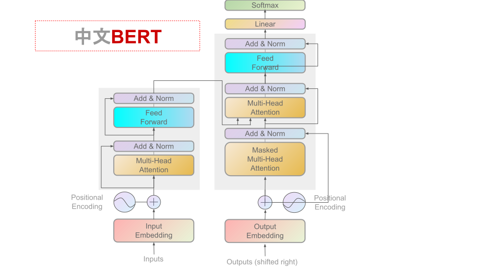

[**中文说明**](./readme.md) | [**English**](./readme_en.md)

<p align="center">
    
</p>
<p align="center">
    <a href="https://github.com/shendezhou/Chinese-PreTrained-BERT/blob/master/LICENSE">
        
    </a>
</p>

This project provides a Chinese oriented BERT pre training model, which aims to enrich Chinese natural language processing resources and provide a variety of Chinese pre training models.
We welcome all experts and scholars to download and use them, and work together to promote and develop the construction of Chinese resources.

This project is based on Google's official bert: https://github.com/google-research/bert

Other related resources：
- Chinese BERT pre training model：https://github.com/ymcui/Chinese-BERT-wwm

See more published resources：https://github.com/ 

## NEWS
**2021/2/6 All models support pytorch, tensorflow1 and tensorflow2. Please call or download them through the transformers library. https://huggingface.co/**


<details>
<summary>Historical news</summary>
2021/2/6The models published in this directory can be accessed to [hugging face transformers](https://github.com/huggingface/transformers) in the future, view [quick load](#quick load)

2021/2/6 `BERT-wwm-base-qa`It can be downloaded. View [Model Download](#model download)

2021/2/6 provides a Chinese 'BERT tiny' model trained on a small-scale general corpus (12.5mb) [TBD]. Check [Model Download] (# model download)
</details>

## Content guidance
|Chapter | description|
|-|-|
|[introduction] (# introduction) | introduction to the basic principle of bet WwM|
|[Model Download] (# model download) | provides the Chinese pre training BERT download address|
|[baseline system effect] (# baseline system effect) | some baseline system effects are listed|
|[pre training details] (# pre training details) | relevant description of pre training details|
|[fine tuning details of downstream tasks] (# fine tuning details of downstream tasks) | description of fine tuning details of downstream tasks|
|[FAQ] (#faq) | FAQ|
|[reference] (# reference) | technical report of this catalogue|


## Introduction
**Whole word masking (WwM) * *, temporarily translated as' full word mask 'or' whole word mask ', is an upgraded version of best released by Google on May 31, 2019, which mainly changes the training sample generation strategy in the original pre training stage.
In short, the original word segmentation method based on wordpiece will cut a complete word into several sub words, which will be randomly masked when generating training samples.
In the whole word mask, if part of the wordpiece sub word of a complete word is masked, other parts of the same word will also be masked, that is, the whole word mask.
**It should be noted that the mask here refers to the generalized mask (replace with [mask]; keep the original word; randomly replace with another word), not limited to the case that the word is replaced with '[mask]' tag.
For more detailed description and examples, please refer to: # 4]（ https://github.com/ymcui/Chinese-BERT-wwm/issues/4 )**
Similarly, in Google's official "best base, Chinese", Chinese is segmented at the granularity of * * character * *, without considering the traditional Chinese word segmentation (CWS) in NLP.
We apply the whole word mask method to Chinese, use Chinese Wikipedia (including simplified and traditional) for training, and use [HTU LTP]（ http://ltp.ai ）As a word segmentation tool, that is to say, mask all the Chinese characters that make up the same * * word * *.
The following text shows an example of the generation of the full word mask.
**Note: for convenience of understanding, only the case of replacing with [mask] label is considered in the following example.**
|Description | example|
| :------- | :--------- |
|The original text | uses a language model to predict the probability of the next word. |
|Word segmentation text | uses language models to predict the probability of the next word. |
|The original mask input | uses the language [mask] type to [mask] test the pro [mask] # liteness of the next word. |
|Full word mask input | use the language [mask] [mask] to [mask] [mask] of the next word. |

## Model Download
***`BERT-wwm-base-qa`**：12-layer, 768-hidden, 12-heads, 110M parameters()
***`BERT-wwm-large-qa`**：24-layer, 768-hidden, 16-heads, 330M parameters()


| Model abbreviation | corpus | Google download | Baidu cloud Download|
| :------- | :--------- | :---------: | :---------: |
|**`BERT-wwm-base-qa, Chinese`** |**中文问答/<br/>通用数据<sup>[1][2]</sup>** |**[TensorFlow1](https://drive.google.com/drive/folders/11B-bU8I2BUvtel4100GkqmeprWPvkI8R?usp=sharing)** <br/>**[TensorFlow2](https://drive.google.com/drive/folders/1-yx_t3u5gAuxlrmVQnkv8msKlduX3HOh?usp=sharing)** <br/>**[PyTorch](https://drive.google.com/drive/folders/1-wnz-EC9znkZz-DW40Mhisr4PaejtctC?usp=sharing)** |**[TensorFlow1,密码:tfxl]()** <br/>**[TensorFlow2,密码:tfxl]()** <br/>**[PyTorch,密码:toxl]()** |
|**`BERT-wwm-large-qa, Chinese`** |**中文问答/<br/>通用数据<sup>[1][3]</sup>** |**[TensorFlow1](https://drive.google.com/drive/folders/11JvzcJvuhxYbVSNWUutC57-zP2Y1gGV5?usp=sharing)** <br/>**[TensorFlow2](https://drive.google.com/drive/folders/10COzeCg9AUCLWzIyPhkEC6Mpm2Od2OnP?usp=sharing)** <br/>**[PyTorch](https://drive.google.com/drive/folders/1-2U4oaOpbb5nlUOUBMdurxyoO7qMBBxf?usp=sharing)** |**[TensorFlow1,密码:tfxl]()** <br/>**[TensorFlow2,密码:tfxl]()** <br/>**[PyTorch,密码:toxl]()** |
|**`BERT-wwm-large-qa, Chinese`** |**中文问答/<br/>通用数据<sup>[1][4]</sup>** |**[TensorFlow1](https://drive.google.com/drive/folders/11U8Pd9hRaT3MEe7J6V05RC8_QMfPPccc?usp=sharing)** <br/>**[TensorFlow2](https://drive.google.com/drive/folders/10X8fxslV0Oo5jEbkK9tNGzmqpKT86xT0?usp=sharing)** <br/>**[PyTorch](https://drive.google.com/drive/folders/11Pd5sy2jRePz5AVlOdImRYNDSbCtwtAS?usp=sharing)** |**[TensorFlow1,密码:tfxl]()** <br/>**[TensorFlow2,密码:tfxl]()** <br/>**[PyTorch,密码:toxl]()** |

> [1] general data includes: question and answer data, the total size is 12.5mb, the number of records is 10000, and the number of words is 72000.  
> [2] one round of training, maximum string length 512, batch = 2  
> [3] one round of training, maximum string length 128, batch = 8  
> [4] Max string length 128, batch = 8, after one round of training; max string length 256, batch = 4, another round of training.  


### PyTorch/Tensorflow Versions

Pytorch version, TF1 and TF2 version are provided.

### instructions

The Chinese mainland recommends the use of Baidu cloud download points. Overseas users recommend using Google download points, and the `BERT-wwm-base-qa` model file size is about**454M** and**1.3G**. Take tensorflow version of `bert WwM base QA, Chinese` as an example. After downloading, unzip the zip file to get the following results:
```
tf_chinese_BERT_base_L-12_H-768_A-12.zip
    |- checkpoint                                           # 存盘点信息
    |- BERT_tiny_chinese.ckpt.data-00000-of-00001          # 模型权重
    |- BERT_tiny_chinese.ckpt.index                        # 模型index信息
    |- BERT_tiny_chinese.ckpt.data                         # 模型meta信息
    |- vocab.txt                                            # 分词词表
```

TensorFlow2版本为：

```
tf2_chinese_BERT_base_L-12_H-768_A-12.zip
    |- tf_model.h5           # 模型权重
    |- config.json           # 模型参数
    |- vocab.txt             # 分词词表
```

Pytorch版本为：

```
chinese_BERT_base_L-12_H-768_A-12.zip
    |- pytorch_model.bin     # 模型权重
    |- config.json           # 模型参数
    |- training_args.bin     # 模型训练信息
    |- vocab.txt             # 分词词表
```

###Fast loading
Relying on [hugging face transformers 3.1.0](https://github.com/huggingface/transformers) The above models can be easily called.
```
tokenizer =  AutoTokenizer.from_ pretrained("MODEL_ NAME")
model =  AutoModel.from_ pretrained("MODEL_ NAME")
```

Where ` model_ The corresponding list of name ` is as follows:
|Model name | model_ NAME |
| - | - |
| BERT-wwm-base-qa-Chinese | /chinese-BERT-wwm-base-qa<sup>[1]</sup>|
| BERT-wwm-large-qa-Chinese | /chinese-BERT-wwm-large-qa<sup>[1]</sup>|

>[1] to upload, you need to download manually.


## Baseline system effect
In order to compare the baseline effect, we conducted tests on the following Chinese data sets. This paper compares Chinese best WwM ext, BERT base and BERT tiny.
Limited time and energy, and can not cover more categories of tasks, please try.

## Pre training details
The following takes the 'BERT tiny' model as an example to explain the details of pre training.


### Generating Thesaurus
According to the official tutorial steps of best, you need to first use [word piece](https://pypi.org/project/tokenizers/) Generate a vocabulary.
Wordpiece is a subword tagging algorithm for Bert, distilbert and Electra. The algorithm is summarized in Japanese and Korean speech search (Schuster et al., 2012), which is very similar to BPE. Wordpiece first initializes the vocabulary to contain each character in the training data, and gradually learns a given number of merge rules. Unlike BPE, wordpiece does not select the most frequent symbol pairs, but the ones that maximize the possibility of adding training data to the vocabulary.
So what does that mean? Referring to the previous example, maximizing the possibility of training data is equivalent to finding a pair of symbols, and the probability of which is divided by the probability of its first symbol and then divided by the probability of its second symbol is the largest of all pairs of symbols. E. Only when the probability of "UG" divided by "U" and "g" is greater than any other sign pair, "U" followed by "g" will be merged. Intuitively, wordpiece is slightly different from BPE in that it evaluates what it loses by merging two symbols to make sure it's worth it.
In this project, we use the vocabulary size of 21128, and the rest of the parameters use the default configuration in the official example.
```
# Initialize a tokenizer
tokenizer = BertWordPieceTokenizer()
# Customize training
tokenizer.train(files=paths, vocab_size=21_128, min_frequency=0, special_tokens=[
                "[PAD]",
                "[UNK]",
                "[CLS]",
                "[SEP]",
                "[MASK]",
                "<S>",
                "<T>"
                ])

```


### Pre training
After obtaining the above data, as of February 6, 2021, using the wordpiece vocabulary (model) of bet WwM ext (the wordpiece model based on general data will be used in the future), the pre training of bet will be officially started.
The reason why it is called 'bet WwM base QA' is that compared with 'bet WwM ext', other parameters have not changed, mainly because of the limitation of computing devices.
The command used is as follows:
```
    from transformers import (
        CONFIG_MAPPING,
        MODEL_WITH_LM_HEAD_MAPPING,
        AutoConfig,
        BertConfig,
        RobertaConfig,
        AutoModelWithLMHead,
        BertForMaskedLM,
        RobertaForMaskedLM,
        AutoTokenizer,
        DataCollatorForLanguageModeling,
        HfArgumentParser,
        LineByLineTextDataset,
        PreTrainedTokenizer,
        TextDataset,
        Trainer,
        TrainingArguments,
        set_seed,
        BertTokenizer
    )
   
    TEMP="temp/"
    
    parser = argparse.ArgumentParser()
    parser.add_argument(
        '-c', '--config_file', default='config/bert_config.json',
        help='model config file')
    
    args = parser.parse_args()
    with open(args.config_file) as fin:
        config = json.load(fin, object_hook=lambda d: SimpleNamespace(**d))
    
    bert_config = BertConfig.from_pretrained(config.bert_model_path, cache_dir=TEMP)
    
    WRAPPED_MODEL = BertForMaskedLM.from_pretrained(
                config.bert_model_path,
                from_tf=False,
                config=bert_config,
                cache_dir=TEMP,
            )
    for param in WRAPPED_MODEL.parameters():
        param.requires_grad = True
    WRAPPED_MODEL.train()
    
    tokenizer = BertTokenizer.from_pretrained(config.bert_model_path)
    WRAPPED_MODEL.resize_token_embeddings(len(tokenizer))
    
    print("dataset maxl:", config.max_seq_len)
    
    dataset = LineByLineTextDataset(
        tokenizer=tokenizer,
        file_path=config.train_file_path,
        block_size=config.max_seq_len,
    )
    data_collator = DataCollatorForLanguageModeling(
        tokenizer=tokenizer, mlm=True, mlm_probability=0.15
    )
    
    """### Finally, we are all set to initialize our Trainer"""
    training_args = TrainingArguments(
        output_dir=TEMP,
        overwrite_output_dir=True,
        num_train_epochs=1,
        per_device_train_batch_size=config.batch_size,
        save_steps=10_000,
        save_total_limit=2,
        tpu_num_cores=8,
    )
    
    trainer = Trainer(
        model=WRAPPED_MODEL,
        args=training_args,
        data_collator=data_collator,
        train_dataset=dataset,
        prediction_loss_only=True,
    )
    
    
    trainer.train(model_path=config.bert_model_path)
    WRAPPED_MODEL.to('cpu')
    trainer.save_model(output_dir=config.trained_model_path)
    torch.save(WRAPPED_MODEL.state_dict(), os.path.join(config.trained_model_path, 'pytorch_model.bin'))

```


## Fine tuning details of downstream tasks

The device used for downstream task fine tuning is Google cloud GPU (16g HBM). The following briefly describes the configuration of each task fine tuning.

**Please refer to [TBD] for relevant codes Project.**


## FAQ

**Q: How to use this model?**
A: Google released the Chinese bet how to use, this is how to use.
**The text does not need word segmentation, and WwM only affects the pre training process and does not affect the input of downstream tasks.**

**Q: Is there a pre training code available?**
A: Unfortunately, I can't provide the relevant code, the implementation can refer to [# 10]（ https://github.com/ymcui/Chinese-BERT-wwm/issues/10 ）And [# 13]（ https://github.com/ymcui/Chinese-BERT-wwm/issues/13 )。

**Q: Where can XX data set be downloaded?**
A: Please check the 'data' directory and the task directory` README.md `The data source is indicated. For copyrighted content, please search by yourself or contact the original author for data.

**Q: Are there any plans to release larger models? For example, the best large WwM version?**
A: If we get better results from the experiment, we will consider releasing a larger version.

**Q: You're lying! Results cannot be reproduced 😂**
A: In the downstream task, we use the simplest model. For example, for classification tasks, we use ` run directly_ classifier.py `(provided by Google).
If the average value cannot be reached, it indicates that there is a bug in the experiment itself, please check carefully.
There are many random factors in the highest value, and we can't guarantee that we can reach the highest value.
Another recognized factor: reducing the batch size will significantly reduce the experimental effect. For details, please refer to the related issues of bet and xlnet directory.

**Q: I've got better results than you!**
A: Congratulations.

**Q: How long did the training take and what equipment did it use?**
A: The training is completed in Google TPU V3 Version (128G HBM). It takes about 4 hours to train bert WwM base and 8 hours to train bert WwM large.

**Q: Who is Ernie?**
A: The Ernie model in this project refers to the [Ernie] model proposed by Baidu company（ https://github.com/PaddlePaddle/LARK/tree/develop/ERNIE ）Instead of [Ernie] published by Tsinghua University in ACL 2019（ https://github.com/thunlp/ERNIE )。

**Q: The effect of bet WwM is not very good in all tasks**
A: The purpose of this project is to provide a variety of pre training models for researchers to freely choose bet, Ernie, or bet WwM.
We only provide experimental data, but we have to try our best to get a conclusion.
One more model, one more choice.

**Q: Why don't you try it on some datasets?**
A: Frankly
1) No energy to find more data;
2) It's not necessary;
3) No money;

**Q: Briefly evaluate these models**
A: Each has its own emphasis and merits.
The research and development of Chinese natural language processing needs the joint efforts of many parties.

**Q: More details about the 'Roberta WwM ext' model?**
A: We integrate the advantages of Roberta and Bert WwM to make a natural combination of them.
The differences from the previous models in this catalog are as follows:
1) In the pre training stage, the WwM strategy was used for mask (but dynamic masking was not used)
2) Simply cancel next sense prediction (NSP) loss
3) It is no longer necessary to use the first max_ Len = 128 and then max_ Len = 512 training mode, direct training max_ len=512
4) The training steps should be extended appropriately
It should be noted that this model is not the original Roberta model, but just a model trained by similar Roberta training method, that is, Roberta like Bert.
Therefore, when using downstream tasks and transforming models, please handle them in the way of Bert instead of Roberta.
   
**Q: ？**
A: 。


## Citation
If the contents in this catalogue are helpful to your research work, you are welcome to quote the following technical reports in the paper:
https://arxiv.org/abs/
```
TBD
```


## Thank you
Project Author: tsinghuaboy
During the construction of the project, the following warehouses have been referred to. Thank you here:
- BERT：https://github.com/google-research/bert
- Chinese best pre training model：https://github.com/ymcui/Chinese-BERT-wwm

## Disclaimer
This project is not [Bert official](https://github.com/google-research/bert) Published Chinese BET model.
The content of the project is only for technical research reference, not as any conclusive basis.
Users can use the model freely within the scope of the license, but we are not responsible for the direct or indirect losses caused by using the content of the project.

## Focus on us
Welcome to Zhihu column.
[learning interest group](https://www.zhihu.com/column/thuil)

## Problem feedback &amp; contribution
If you have any questions, please submit them in GitHub issue.
We don't have an operation to encourage netizens to help each other solve problems.
If you find implementation problems or are willing to build the project together, please submit a pull request.